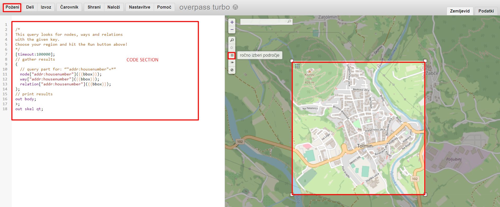

## Network generation
To generate a network of a city infrastructure of an arbitrary city follow these instructions.

First, you will need to go to [http://overpass-turbo.eu/#](http://overpass-turbo.eu/#) select the area that best describes the chosen city (in given example, you can see the city of Tolmin). 


Next, you should run and download the results of the following commands:
  * **Fetch crossroads** to `data/osm/{city-name}/{city-name}-crossroads`,
  * **Fetch nodes** to `data/osm/{city-name}/{city-name}-nodes`,
  * **Fetch ways** to `data/osm/{city-name}/{city-name}-ways`.

#### Fetch crossroads
```
<!-- Only select the type of ways you are interested in -->
<query type="way" into="relevant_ways">
  <has-kv k="highway"/>
  <has-kv k="highway" modv="not" regv="footway|cycleway|path|service|track"/>
  <bbox-query {{bbox}}/>
</query>

<!-- Now find all intersection nodes for each way independently -->
<foreach from="relevant_ways" into="this_way">  

  <!-- Get all ways which are linked to this way -->
  <recurse from="this_way" type="way-node" into="this_ways_nodes"/>
  <recurse from="this_ways_nodes" type="node-way" into="linked_ways"/>
  <!-- Again, only select the ways you are interested in, see beginning -->
  <query type="way" into="linked_ways">
    <item set="linked_ways"/>
    <has-kv k="highway"/>
    <has-kv k="highway" modv="not" regv="footway|cycleway|path|service|track"/>
  </query>

  <!-- Get all linked ways without the current way --> 
  <difference into="linked_ways_only">
    <item set="linked_ways"/>
    <item set="this_way"/>
  </difference>
  <recurse from="linked_ways_only" type="way-node" into="linked_ways_only_nodes"/>

  <!-- Return all intersection nodes -->
  <query type="node">
    <item set="linked_ways_only_nodes"/>
    <item set="this_ways_nodes"/>
  </query>
  <print/>
</foreach>
```
##### Fetch nodes
```
/*
This query looks for nodes, ways and relations 
with the given key.
Choose your region and hit the Run button above!
*/
[timeout:100000];
// gather results
(
  // query part for: “"addr:housenumber"=*”
  node["addr:housenumber"]({{bbox}});
  way["addr:housenumber"]({{bbox}});
  relation["addr:housenumber"]({{bbox}});
);
// print results
out body;
>;
out skel qt;
```
##### Fetch ways
```
[timeout:25];
// gather results
(
  // query part for: “highway=*”
  way["highway"]({{bbox}});
);
// print results
out body;
>;
out skel qt;
```

Once you have generated the data from the OverStreetMap API, you should run several scripts:
1. First run `python data-generation.py`. The script returns your first network with nodes and edges connected.
2. To get the real distance and duration needed to travel an edge you should also run `python road-distance.py` (important: see the instructions below to set you API key for running `road-distance.py`).

## Road distances
For running `road-distance.py` you need to set [HERE](https://developer.here.com/) Api key in environment variables.
To do that, create `.env` file and add the following line, where you replace `API_KEY`
with an actual api key:
```
HERE_API_KEY={API_KEY}
```
After setting the api key, you can run the script with:
```shell script
python road-distance.py -n <GRAPH_NAME>
# example: python road-distance.py -n "Škofja Loka"
```
Where you replace `<GRAPH_NAME>` with the name of the graph, for which you would like to calculate the distances.
Repository contains graphs for the following Slovenian cities: `Pungert`, `Tolmin`, `Škofja Loka`.